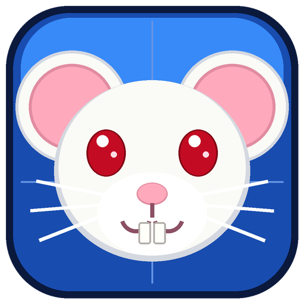

# BlueEngine



An AI-first Rust 3D engine foundation for building small, testable prototypes.

Curated games, prototypes, test content, and demos are copied automatically to
[BlueEngineGames](https://github.com/kevstermcgee/BlueEngineGames). See
[`docs/GAMES_PUBLISHING.md`](docs/GAMES_PUBLISHING.md) to validate an export or add
new content to the publication manifest. Ready-to-play Windows packages are on the
[latest BlueEngineGames release](https://github.com/kevstermcgee/BlueEngineGames/releases/latest).
Continues the complete BlueEngineAntigravity history. The primary development
fixture is **Blue Test Lab**; furnished legacy maps remain reusable reference assets.

## BlueEngineSandbox

Run `cargo run --release --locked --bin blueengine-sandbox` for the central asset,
character and map workbench. Includes 78 specimens, four new maps and six cosmetic
character skins alongside the original content. See the [sandbox guide](assets/games/blueengine-sandbox/README.md).

## Start here

- Content authors: `python tools/author.py describe`, then [tools/AUTHORING.md](tools/AUTHORING.md).
- Asset discovery: `python tools/assets.py search "desk lamp"`; see the [asset library contract](assets/README.md).
- Native discovery: `be2-tools describe`, `be2-tools search multiplayer`, `be2-tools catalog`. Inside an engine checkout, before
  any build, use `python tools/be2.py context "FEATURE" --compact` (query up to 100 characters), then `python tools/be2.py check --changed`.
- Rust prototypes: [compact quickstart](docs/AI_QUICKSTART.md), `cargo run --locked --no-default-features --example prototype`.
- A game: `python3 tools/be2.py start "<game prompt>" --compact` selects the starter. `be2-tools new-game NAME DIR` defaults to **portable**, with Rust rules. Pass `stock` explicitly for declarative `GameDocument` rules. Offline 2D enemies use `two-d`; spatial 3D enemies/AI/physics and custom multiplayer use `custom-sim`. See [the starter table and completion gates](docs/GAME_QUICKSTART.md).
- Custom presentation or your own simulation: [visible-client boundary and kit](docs/CUSTOM_CLIENT.md), `cargo run --locked --example custom_client`.
- Save states (F5/F9, autosave, a server that resumes, saves for your own simulation): [save-state contract](docs/SAVE_STATE.md), `be2-tools save-info FILE`.
- Behavioral tests: [scripted headless scenarios](docs/BEHAVIORAL_TESTING.md).
- Find a capability without building or reading source: `python tools/be2.py context movement`.
- Engine maintenance: [AGENTS.md](AGENTS.md), [scoped workflow](docs/CHANGE_WORKFLOW.md); load architecture only for the relevant subsystem.

<!-- starters:begin -->
<!-- Generated by tools/starter_docs.py; edit templates/starters.json. -->
| Starter | Rules and use | Collision | Networking |
|---|---|---|---|
| [`portable`](docs/PORTABLE_GAMES.md) (CLI default) | Flexible offline 2D rules with hybrid drawing; CLI default | 2D | offline |
| [`two-d`](docs/TWO_D.md) | Offline 2D Rust rules, including enemies, projectiles and scoring | 2D | offline |
| [`three-d`](docs/PORTABLE_GAMES.md) | 3D drawing over a planar simulation; use custom-sim for 3D enemies/AI/physics | 2D | offline |
| [`hybrid`](docs/PORTABLE_GAMES.md) | 2D rules with 2D/3D drawing; use custom-sim for spatial 3D mechanics | 2D | offline |
| [`stock`](docs/GAME_QUICKSTART.md) | Declarative GameDocument counters, interactables, timers, triggers and movers | 3D | offline, native-multiplayer |
| [`custom-sim`](docs/CUSTOM_SIM_CHEATSHEET.md) | Game-owned fixed-step rules, spatial 3D enemies/AI/physics or native netplay | Game-owned 3D | offline, native-multiplayer |
<!-- starters:end -->

Cargo package/binaries remain `be2`; the library remains `vesper3d` for compatibility.

## Run and author

```sh
cargo run --locked --bin be2
cargo run --locked --no-default-features --bin be2-headless -- --server 127.0.0.1:4000 --transport development
cargo run --locked --bin be2 -- --connect 127.0.0.1:4000 --transport development
cargo run --locked --no-default-features --bin be2-headless -- --server 127.0.0.1:4000 --auth-key "LONG_RANDOM_SECRET"
cargo run --locked --bin be2 -- --connect 127.0.0.1:4000 --auth-key "LONG_RANDOM_SECRET"
cargo run --locked --no-default-features --bin be2-tools -- describe
cargo run --locked --no-default-features --bin be2-tools -- export-lab lab.json
cargo run --locked --bin be2 -- --map lab.json
```

Use the same map/game on both peers. Protocol 8 rejects different initial content.
Output files must be new. `export-house` and assets/maps/starters retain reference maps.
WASD/arrows move, mouse looks, Space jumps, Ctrl/C crouches, E carries/drops,
left click uses the demo tool, scroll selects tools, Q changes perspective, Esc pauses.
Native controllers are enabled in the client: left/right sticks move/look, A/Cross
jumps, B/Circle crouches, X/Square interacts, Y/Triangle changes perspective,
left stick click sprints, RT/R2 uses the tool, bumpers select tools, and Start pauses.
D-pad and A/Cross select characters and pause-menu items. See [controller support](docs/CONTROLLERS.md).
Scientist/Feta remain demo profiles. GameDocument v1 adds configurable movement and simple interaction objectives; see [game quickstart](docs/GAME_QUICKSTART.md).

## Current capabilities and limits

- Shared 60 Hz player simulation; graphics/audio-free headless build; Rapier props.
- Transport-agnostic authoritative server, client prediction, interpolation, spatial interest,
  acknowledged deltas/keyframe recovery and authoritative prop ownership/combat. That is the **stock server**
  (`be2-headless --server`): 8 players by default, up to 1024 with `--max-players`, graceful shutdown, autosave and resume.
  Games with their own simulation use [`viewer::netplay`](docs/NETPLAY.md) instead, which has its own server loop, one
  snapshot format for everyone and no partial replication or interest management. `be2-tools describe` prints the
  exact limits per path (`runtime_support`), read from the code.
- Validated MapDocument authoring, stable semantic IDs, transactional edits,
  a structured and extensible asset catalog, bounded discovery and route/capture tools.
- SceneBuilder/prelude for static boxes and catalog props; ID-based impulse/position APIs.
- Reusable rendering-free FPS foundation with validated weapon catalogs, ten starter
  firearms, deterministic fire/reload/spread, smooth ADS and authoritative TDM rules.
  [`BlueDM`](https://github.com/kevstermcgee/BlueEngineGames/tree/main/games/bluedm) is the standalone online reference game.

Networking uses one packet path with an 1100-byte cross-transport ceiling: world updates are compact binary (protocol 8), every
other message is JSON.
`--transport development` (the compatibility default) is raw, unencrypted UDP for
local work and impairment testing. `--transport production` uses QUIC datagrams over
TLS 1.3 and pins the server certificate selected by `BLUE_TLS_CERT_FILE` (or the
bundled default); the server loads its PKCS#8 key from `BLUE_TLS_KEY_FILE`. Supplying `--auth-key` on both peers additionally enables
client HMAC challenge-response, session tokens and replay protection. Neither profile
hides traffic metadata or provides session migration. A world too big for one packet is sent as
several acknowledged partial updates, nearest records first; a single record that cannot fit is an error, not
silently dropped. Map fingerprints detect
accidental mismatch, not hostile forgery. See the
[hosting guide](docs/HOSTING.md) for the runnable server's exact security boundary.

## Validation

`python tools/be2.py check` runs formatting, rustdoc, tests and Clippy in both feature
configurations. `check --changed --plan` explains a conservative change-specific plan;
unknown inputs retain every engine gate. Generated games use their own project check,
with `--content-only` for content iteration. See [workflow and limits](docs/CHANGE_WORKFLOW.md).
CI runs the full suite on Linux and Windows. Focused suites cover prototype APIs,
native capability evidence, content handshakes, malformed packets and multiplayer
including a separate server process and a QUIC authoritative handshake. Headless
microbenchmarks enforce checked-in absolute regression budgets in tests and in
`be2-tools bench`. See [the refinement report](docs/REFINEMENT.md) for context.

## History and attribution

Kevin Ward directed the project; OpenAI Codex contributed engine/tooling development;
Google DeepMind Antigravity contributed the earlier fork, integrations and weapons.
Original authorship, Git history and MIT license are preserved. BlueEngine continues
that work with OpenAI Codex. Historical Vesper/Blue v1 documentation remains for
asset/offline-renderer compatibility; current runtime guidance is linked above.

Try the data-driven objective demo with `Launch Three Switches.cmd` (after a release build), or `be2 --game assets/games/three-switches/game.json`. See [game quickstart](docs/GAME_QUICKSTART.md) and [implementation evidence and limits](docs/GAME_REFINEMENT.md).

Playable game presentation follows [the shared presentation contract](docs/GAME_PRESENTATION.md). Use the `presentation` feature for `GameShell` and cached static rendering.

Shared standalone-game infrastructure: [gameplay kit](docs/SHARED_GAMEPLAY.md). Generated games call `playable::run_game_with_options` for shared local/online gameplay. `MapPlayer` remains a static viewer; custom presentation can use the graphics-free `GameSession`.
