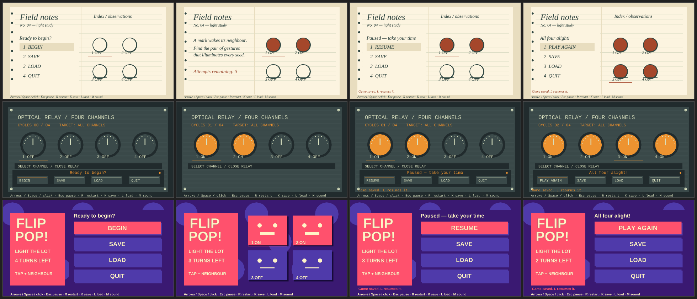
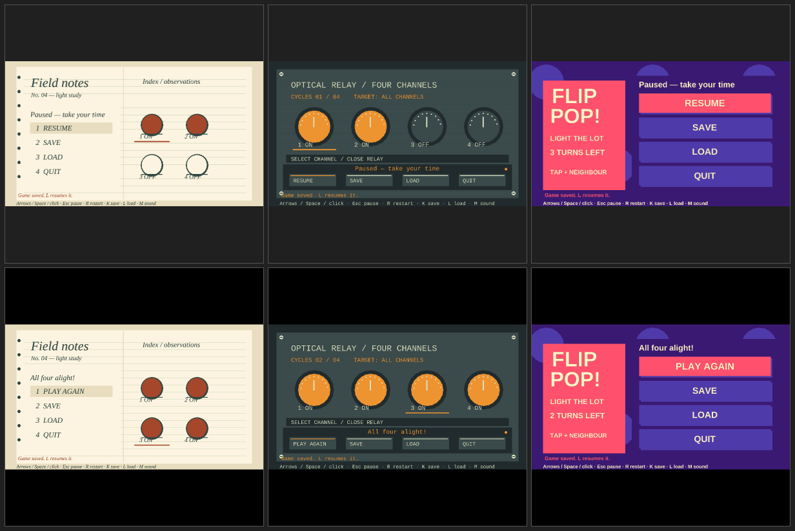
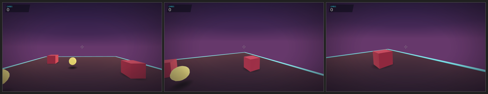

# Creative identity: restrictions, implementation and evidence

Starting revision: `2354e507975594a76046058470c70934cad9e6e8` (current main when work
began). Work is isolated from unrelated local changes. The engine standardizes
simulation, input, lifecycle, storage and asset validation; games choose appearance.

## Audit

| Observation at the starting revision | Cause | Resolution |
|---|---|---|
| “First-person 3D exploration game” selected three-d without a camera gap | Authoring router discarded camera intent; portable sample has no FPS controller | Explicit camera capabilities, retained requirements and tested routing to custom-sim; incompatible explicit starters report implementation work |
| Shared start/pause/results always used one panel and HUD | Shared-client restriction; custom loops were an inconvenient escape route | Read-only `UiFrame`, game-rendered `Layout` action regions, default `Theme`; shared client owns all behavior |
| Shared Scene text used the built-in face | Shared drawing restriction; Macroquad already supports font assets | Runtime named `FontAsset`, measured text and stable glyph preparation; no new typography backend |
| Shared banks rejected sound effects; numeric cues used fixed Coin/Hit/Success seeds | Adapter restriction; existing AudioBank already handles named effects | Reuse AudioBank for effects and loops, semantic bindings/volume, optional legacy fallback |
| Similar palettes, menu positions, particles and ambient scores recurred | Starter copying and guidance, rather than an underlying renderer/synthesis limit | Default presentation remains convenient; full interface/particle opt-out, deliberate brief, three contrasting examples |
| IdeaForge emphasized mechanics/genre | Concept/build/review guidance | Small creative identity brief participates in generation, history comparison, implementation and evidence review; older concepts remain accepted |
| Windows tool-discovery gate failed on runneradmin versus RUNNER~1 | Test compared path spellings rather than the same existing file | `samefile` assertion; discovery behavior and other assertions unchanged |

Existing capabilities already sufficient: portable `World.camera`, native
`FpsCamera`/`View::first_person`, `sweep_boom`, layered Scene assets/render callbacks,
checked AudioProjects (presets, scores, imported PCM, adaptive loops), Snapshot and
storage. None needs a new general framework. Stock/Leo already demonstrate named
authored/imported audio; examples such as Pendulum, Konami, Tetrahedron and Leo have
different gameplay compositions. Their presence alone did not make the shared menu
or portable sound-effect path replaceable.

## Supported authoring boundary

Use [GAME_PRESENTATION](../GAME_PRESENTATION.md#portable-interface-ownership) for
the three levels: default interface, game theme, or complete game rendering with
engine actions. `Game::interface` receives state/metrics and emits Scene draws plus
action rectangles. It cannot own pause/storage authority. Keyboard/controller menu
navigation follows rectangle insertion order. Native hosts can supply a focus
callback with `run_with_focus`; generated Windows hosts do so. Successful actions
consume that frame and clear pending input. Focus loss pauses; regaining focus
requires resume. Outcomes freeze gameplay. Snapshot load is atomic and failed loads
produce notices without replacing authority.

Fonts are ordinary runtime assets. `Renderer::measure` and `Scene::text_with_font`
share raster size and scale; glyphs are prepared before batches draw. Missing,
invalid or undeclared fonts fail visibly. Viewport letterboxing maps drawing and
hit regions through the same logical canvas.

Use [AUDIO](../AUDIO.md#portable-shared-client) for named event bindings, custom
banks, optional defaults, settings and data-only iteration. Rendering audio JSON
into a replacement bundle between launches does not rebuild Rust. Bindings fail on
unknown names; missing/corrupt declared assets fail instead of silently becoming a
default cue. `--mute` bypasses bank loading and synthesis. Audio events are drained
after each authoritative tick; effects and loop mixing remain client concerns.

Discovery level 1/2 leads with a single public authoring contract for presentation,
2D and audio. Level 3 retains implementation ownership. No claim of measured AI
token savings is made. Recorded learning items L-135–L-137 describe the resolved
shared interface/audio and font-atlas friction (token cost unmeasured).

## Demonstration and actual evidence

[Identity Lab](../../examples/identity-lab/README.md) presents exactly the same
four-switch rules as a notebook, mechanical instrument and toy arcade. The layouts,
visual motifs, fonts, motion, effect sources and music/silence differ. They are game
code and assets, not engine-recognized styles. The one rules implementation and
Snapshot kind are shared by all variants.

Rows: notebook, instrument, arcade. Columns: start, gameplay, pause, win. These are
native software-GL captures, assembled without editing the rendered content.
Full loss and focus states are retained by the executable smoke command; loss frames
were also visually inspected. The
640×360 and 800×800 runs use the same layouts/metrics/hit regions; readable text and
letterboxing were visually inspected as well as checked behaviorally.

Columns: notebook, instrument, arcade. Top: small-window pause; bottom: square-window
win. [Native smoke evidence](creative-identity/presentation-evidence.json) verifies
all three presentations, identical authoritative hash sequences, click actions,
pause/focus input rejection, resume, save/load, restart, win/loss, five loaded named
effects per style, missing bindings/effects/fonts, invalid fonts and muted bypass.
The repeatable script uses an isolated binary/assets copy and private player storage.

These captures use the packaged Linux binary. Its first shipping check exposed an
omitted runtime-asset declaration; adding `"package": ["assets"]` to identity.json
made package verification and isolated smoke pass. This required project data,
not a packaging framework change; public font/audio instructions now state it.
[Device evidence](creative-identity/device-evidence.json) separately records actual
X11 keyboard/mouse delivery without a Timeline script: action, pause, rejected paused
click, custom menu arrow/Enter navigation, resume/win, restart, keyboard action with
an unrelated pointer hover, save/load, settings and fullscreen were exercised.
Engine-owned snapshots checked the resulting state. Capture mode started the run;
scripted hit tests cover the custom Start button. This is not controller hardware
or native foreground evidence.

The selected first-person route was scaffolded and run with forward movement,
right/down look and jump cues. Actual frames show the eye-level crosshair view
moving/turning through the native sample (rather than a portable fixed camera).

[Effect measurements](creative-identity/effects.json) show the same confirm event
uses a short broadband paper gesture, a damped low mechanical transient, or an
authored melodic phrase. The files are synthetic/imported or authored scores; no
recording provenance is claimed. [Loop measurements](creative-identity/loops.json)
find no clipping, DC problem or suspected wrap click. The intentionally sparse
notebook room air receives a “too quiet” advisory (−32.47 dBFS peak); this is retained
as a deliberate low background level, not hidden as a passing loudness check.
Instrument has no music; arcade uses a short percussive pitched phrase. Runtime
submission/asset evidence does not certify subjective balance or physical audibility.

## Verification and bounded follow-up

Focused checks cover camera routing, Windows file identity, font failures, named
bindings, shared lifecycle/storage/settings, deterministic rules and prompt usage.
The canonical full checker includes Identity Lab in addition to all existing gates.
CI keeps Linux/Windows engine, container and maintained-game lanes and adds the
isolated native package/presentation smoke on both platforms. Final run outcomes
belong to the delivery and CI evidence; the presence of a gate is not passing evidence.

Deliberately deferred: a general camera controller framework (existing APIs suffice;
unsupported requested behaviors are explicit implementation steps), a new UI engine,
legacy native GameShell visual replacement/stock ASCII-atlas redesign, complex-script
font shaping, per-voice spatial/pitch control and sample-clock stem synchronization.
The shared portable UI improvements also apply to its 3D/hybrid Scene clients.
Existing `run()` hosts keep their legacy focus default; Linux foreground detection
still needs a host callback. Scripted focus tests do not certify OS foreground
delivery. Real controller hardware, speakers and desktop installation require their
own inspection; Linux development captures do not substitute for Windows packaging.

Next steps by impact: inspect physical Windows focus/controller/audio behavior;
apply the presentation boundary to a shipped game with an authored identity;
extend the legacy native shell only when a concrete game needs it; pursue font
shaping/spatial audio only with demonstrated requirements. No merge, deployment or
publication is implied by this report.
